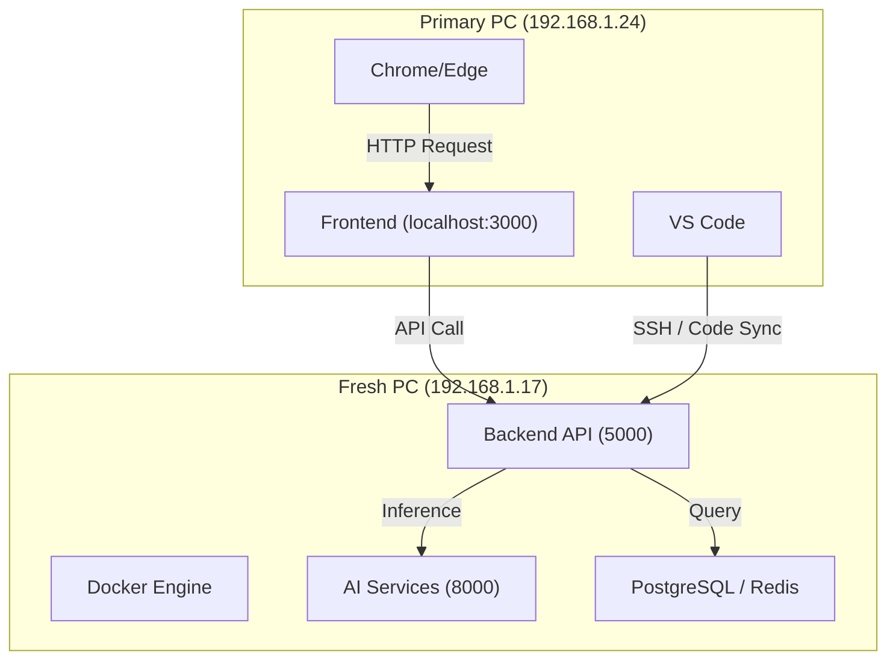

# 🧾 🔥 DUAL-PC SETUP: ARCHITECTURE & WORKFLOW

This document serves as the official configuration guide for the Karan SaaS dual-machine development environment.

## 💻 PRIMARY PC (`192.168.1.24`) — WORK MACHINE
**Role**: Integrated Development Environment (IDE) & UI Testing. This is where you physically sit and write code.

### ✅ Installed Software
- **Visual Studio Code**: Main coding environment.
- **Modern Browsers**: Google Chrome / Microsoft Edge (for frontend testing).
- **Node.js**: Local runtime for the Next.js dev server.
- **Git**: Source control for pushing to repositories.
- **VS Code Remote SSH**: To manage the Fresh PC.

### ✅ Responsibilities
- **Frontend Development**: Runs Next.js at `http://localhost:3000`.
- **Code Authoring**: All logic for both Frontend and Backend is written here.
- **Remote Control**: SSH into the Fresh PC for server management.

---

## 🖥️ FRESH PC (`192.168.1.17`) — SERVER MACHINE
**Role**: High-Performance API Server & Infrastructure Host.

### ✅ Installed Software
- **Docker Desktop**: Host for Postgres, Redis, Meilisearch, etc.
- **Node.js**: Production/Dev runtime for the NestJS backend.
- **Python**: Support for AI/ML modules.
- **Git**: For pulling latest changes if needed.

### ✅ Responsibilities
- **Backend APIs**: Runs NestJS at `http://192.168.1.17:5000`.
- **Databases**: PostgreSQL/Redis containers.
- **AI Services**: Hosted at `http://192.168.1.17:8000`.

---

## 🔗 CONNECTION & COMMANDS
**SSH Access**:
```powershell
C:\Windows\System32\OpenSSH\ssh.exe "arpit solar 3@192.168.1.17"
```

### 📊 DATA FLOW


---

## 🔥 DAILY WORKFLOW (1-CLICK SYNC)
To avoid manual copying, I have created a [sync-to-fresh.ps1](file:///c:/Users/arpit/OneDrive/Desktop/Karan%20Saas/sync-to-fresh.ps1) script.

### 🏃‍♂️ How to Run:
On your **Primary PC**, simply run:
```bash
./sync-to-fresh.ps1
```
### 📦 What it does:
1. **Syncs Only Changes**: Uses `robocopy` to instantly push edits from your machine to the Fresh PC.
2. **Excludes Weight**: It ignores `node_modules` and `.next` folders to keep it lightning fast.
3. **Restarts Backend**: Automatically triggers `docker compose` on the Fresh PC.

---

## ⚡ GOLDEN RULES
- **Rule 1**: Work only on the **Primary PC**.
- **Rule 2**: Run `./sync-to-fresh.ps1` whenever you finish a backend edit.
- **Rule 3**: Frontend (`npm run dev`) stays running on your Primary machine.
