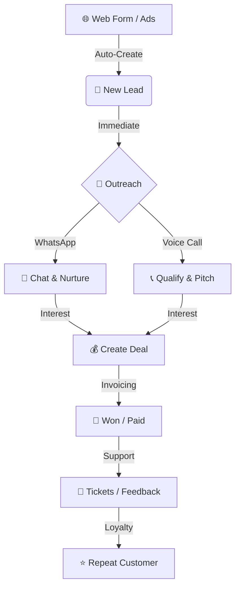

# 🛍️ B2C: Consumer Engagement & High-Volume Sales

Project Alpha is perfectly suited for B2C (Business-to-Consumer) businesses. This guide focuses on how to manage high volumes of individual customers, provide a personal touch, and maximize conversions.

---

## 🔄 The B2C Sales Lifecycle

In B2C, speed and personal connection are everything. Here is how a typical customer moves through your system:

---

## 1. Capturing Leads at Scale

B2C leads often come from your website, social media, or digital ads. 

### Web Forms (Your 24/7 Sales Agent)
- Use the **Web Forms** module to create a simple "Contact Us" or "Get a Quote" form.
- Embed this form on your website.
- **Why?** Every submission creates a lead in the CRM **instantly**, so your team can respond while the customer is still interested.

### Importing Bulk Lists
- If you run offline ads or buy lead lists, use the **Import** feature in the Leads section.
- Tag these leads (e.g., "Facebook Ads Feb") to track which marketing channel performs best.

---

## 2. Personal Outreach with WhatsApp

For consumers, WhatsApp is often more effective than email.

- **Immediate Greeting:** Set up a **Workflow** to send an automatic WhatsApp message the second a new lead arrives.
- **Quick Replies:** Use **Canned Responses** (in the sidebar or chat) to answer common questions like "What are your prices?" or "Where are you located?" in one click.
- **WhatsApp Campaigns:** Use **Campaigns** to send a festival offer or a weekend discount to thousands of customers at once. 

---

## 3. Speed-to-Lead with the Dialer

In B2C, the first business to call the customer usually wins the sale.

- **Campaign Queues:** Assign your team to a "Hot Leads" call campaign.
- **One-Click Calling:** Agents can click the **📞 icon** directly from the lead list to start talking immediately.
- **Follow-up Reminders:** If a customer says "call me back in 2 hours," use **Tasks** to set a reminder with an alarm.

---

## 4. Converting to Sales (Deals & Invoices)

### The B2C Pipeline
Keep your **Deals Pipeline** simple for B2C:
1. **New Inquiry**
2. **Interested / Quote Sent**
3. **Negotiation**
4. **Won / Paid**

### Instant Invoicing
- Once a customer agrees to buy, click **Create Invoice** from the Deal page.
- Send the invoice link via **WhatsApp**.
- Track when they pay using the **Payments** module.

---

## 5. Retention & Support

### Support Tickets
- If a customer has a complaint or a question, open a **Ticket**.
- Link the ticket to their lead profile so you have a complete history of their experience.

### Feedback Surveys
- Use **Surveys** to ask customers how they liked your service. 
- High-scoring customers can be tagged as "Brand Ambassadors" for future rewards.

---

## 💡 Top B2C Success Tips
1. **Respond in under 5 minutes:** B2C leads go cold very fast.
2. **Use Emoji in WhatsApp:** It makes your brand feel more human and approachable.
3. **Track Lead Sources:** Stop spending money on ads that don't bring in "Converted" deals.
4. **Automate the Boring Stuff:** Use workflows for welcome messages and follow-up reminders.

---

*Maximize every lead, talk to every customer, and grow your brand!* 📈
