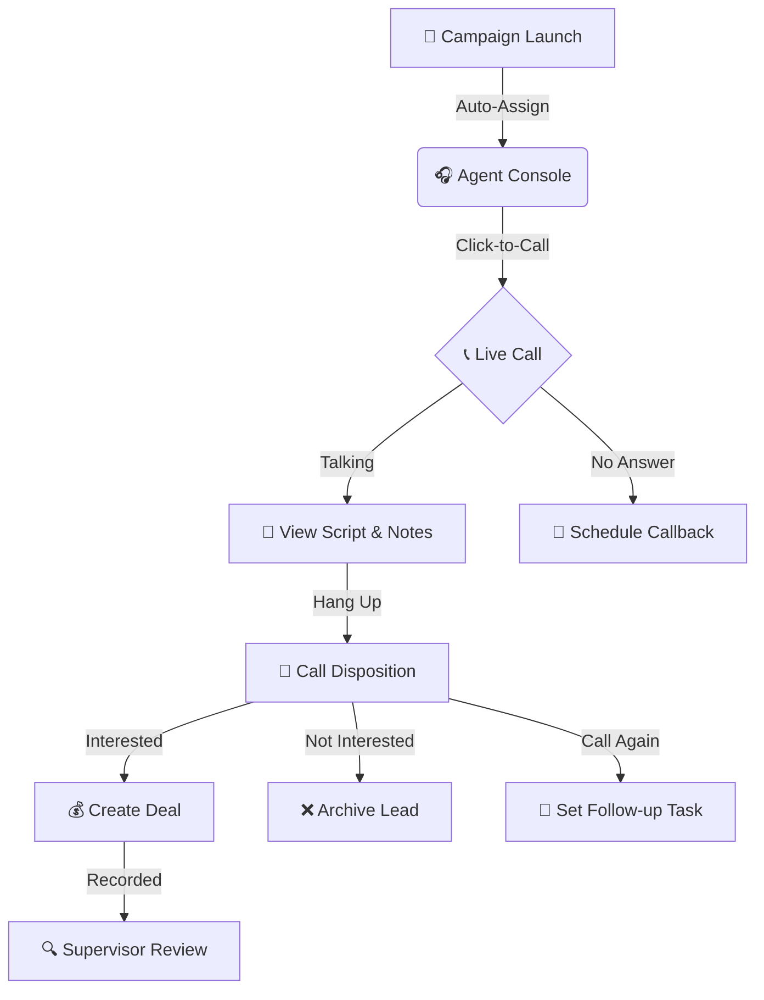

# 📞 Telecalling Operations & Agent Flow

This guide explains the end-to-end workflow for Telecallers (Agents) and Supervisors using the integrated telephony engine.

---

## 🔄 The Telecalling Lifecycle

From lead assignment to call outcome, here is the path a voice interaction follows:

---

## 1. Entering the Agent Console

The **Agent Console** is your primary workspace for high-volume calling.

1.  Click **Dialer** in the sidebar.
2.  **Go Online**: Toggle your status to "Available" (Green) so the system knows you are ready for calls.
3.  **The Queue**: You will see your assigned leads for the current active campaigns.

---

## 2. Making and Handling Calls

### Starting a Call
- Click the green **Call** button next to a lead in your queue.
- The system will dial out using the integrated SIP server. 
- You will hear the ringing in your headset.

### During the Call
- **View Script**: The **Call Script** provided by your manager will appear on the right. Follow the talking points to stay on message.
- **Real-time Notes**: Type notes in the sidebar *while* you talk.
- **Mute/Hold**: Use the on-screen buttons to mute yourself or put the customer on hold.

---

## 3. Ending the Call: Dispositions

When the call ends, you **must** select a "Disposition" before you can move to the next lead. This is critical for reporting.

| Disposition | Action |
|-------------|--------|
| **Interested** | Moves lead to "Qualified" status and prompts for a Deal. |
| **Not Interested** | Marks lead as "Lost" and removes from current campaign. |
| **No Answer** | Automatically reschedules the call for a later time. |
| **Busy** | Retries the call in 30 minutes. |
| **DNC (Do Not Call)** | Permanently blocks the number from all future outreach. |

---

## 4. Supervisor & Quality Monitoring (Admin Only)

Supervisors have additional tools to ensure high-quality interactions.

### Call Recordings & Transcripts
- Every call is recorded and stored securely.
- Go to **Reports** → **Call Logs** to listen to recordings.
- **AI Transcripts**: Clicking a recording will show a word-for-word text transcript of the call.

### Live Monitoring
- Supervisors can see which agents are "In Call," "Available," or "On Break" from the **Supervisor Dashboard**.
- **Listen In**: (If enabled) Click the ear icon next to an active agent to listen to their call in real-time for training purposes.

### Wallboard
- The **Wallboard** displays live stats for the whole floor:
    - Total Calls Today
    - Average Talk Time
    - Best Performing Agent
    - Wait Time in Queues

---

## 💡 Top Telecalling Success Tips
1.  **Always use a Headset:** Built-in laptop mics pick up too much background noise.
2.  **Stick to the Script, but be Human:** Use the script as a guide, not a robotic list.
3.  **Finish your Wrap-up Fast:** Selective the disposition quickly so you are ready for the next call.
4.  **Listen to your own Recordings:** It's the best way to improve your tone and pitch.

---

*Effective telecalling turns voices into value!* 🎧
